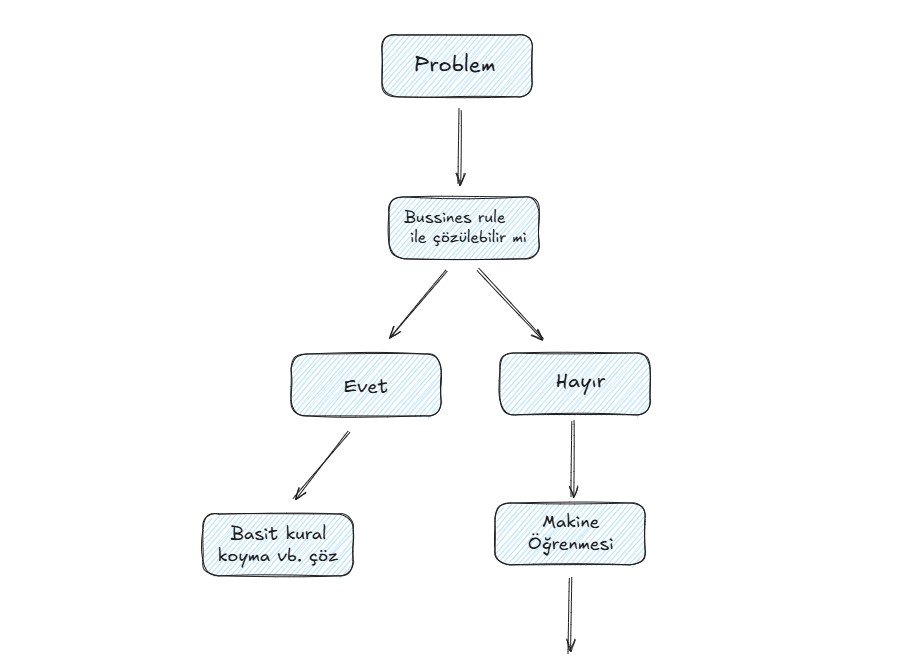
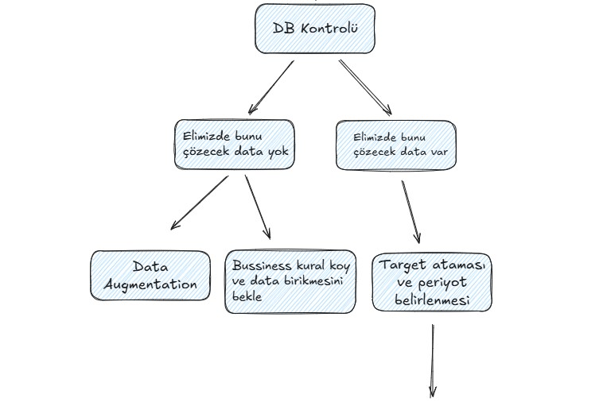
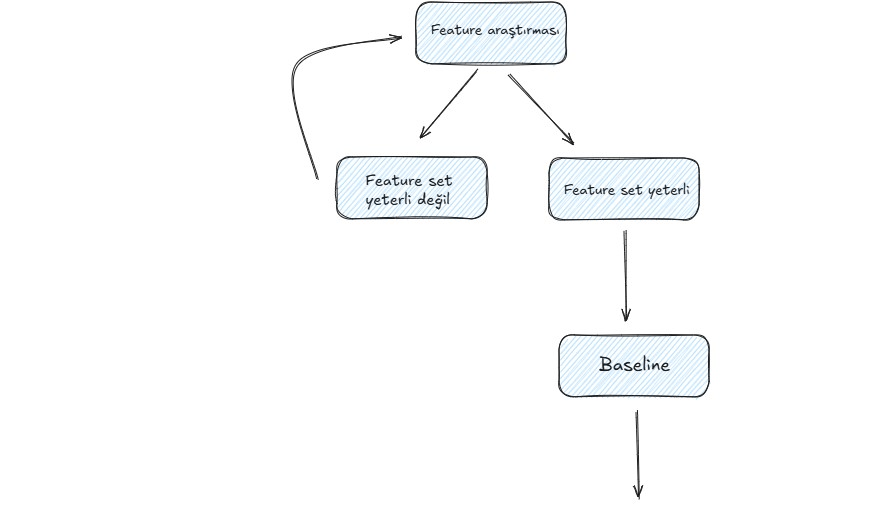
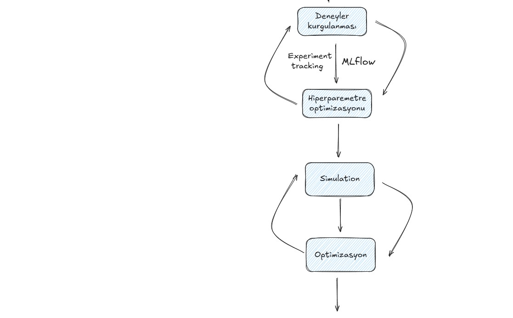
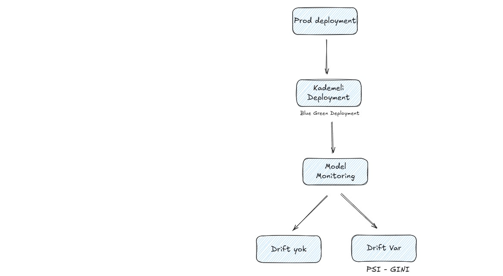

# Gün 9 - Baseline Model

**Eğitmen:** [Enes Fehmi Manan](https://www.linkedin.com/in/enesfehmimanan/)

## İçerik

Bu eğitimde, gerçek hayatta bir makine öğrenmesi projesinin nasıl baştan sona ilerlediği gerçekçi bir bakış açısıyla ele alınmıştır: Önce bir iş problemi tanımlanır, bu problemin business kurallarıyla çözülüp çözülemeyeceğine bakılır, çözülemezse veritabanında uygun verinin olup olmadığı araştırılır, ardından target belirlenir ve feature araştırmasına geçilir. Uygun bir feature seti oluşturulduktan sonra baseline model kurulur, bu baseline üzerine çeşitli deneyler kurgulanarak en iyi pipeline bulunmaya çalışılır, hiperparametre optimizasyonu yapılır ve simülasyonlarla modelin gerçek sistemdeki etkisi test edilir. Simülasyon sonuçları olumlu ise model production'a alınır, ardından model monitoring aşamasında data drift ve model başarısı düzenli olarak izlenir; kayma tespit edildiğinde ise süreç yeniden feature toplama aşamasına dönerek retrain edilir. Kaggle yarışmalarında hazır gelen veri setlerinin aksine, gerçek hayatta veri toplama, feature arama, veritabanındaki değişkenlerin güncelliğini kontrol etme gibi süreçlerin ne kadar zahmetli ve zaman alıcı olduğu vurgulanmış; SMOTE gibi teoride popüler olan tekniklerin pratikte production ortamında kullanılmadığı, iş birimlerinin beklentileri ile model çıktıları arasındaki trade-off'ların sürekli dengelenmesi gerektiği gibi sektörden somut deneyimlerle desteklenmiştir.

